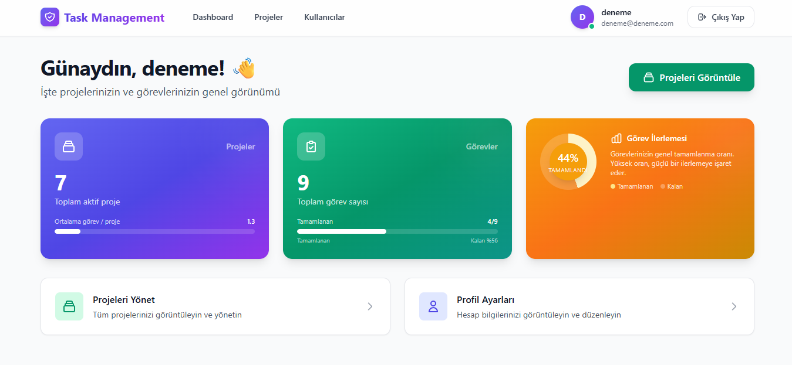
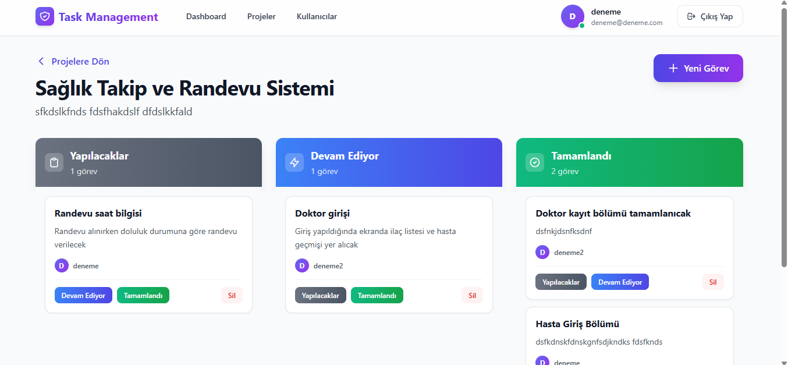
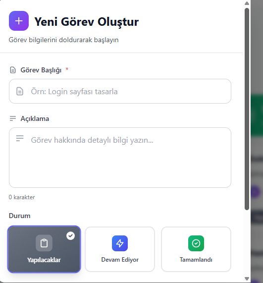

# 🚀 Task Management System

A full-stack task & project management application developed with **ASP.NET Core Web API** and **React**.  
The system allows teams to manage projects, assign tasks, track progress and control users with role-based authorization.

---

## 🧠 Features

- 🔐 JWT Authentication & Authorization
- 👥 Role Management (Admin, Project Manager, Developer)
- 📁 Project Management
- ✅ Task Management (Kanban Board)
- 📊 Dashboard with statistics
- 👤 User Management
- 🔄 Real-time ready infrastructure
- 🎨 Modern and responsive UI

---

## 🏗️ Architecture

This project is built with **N-Tier Architecture**:

- Core
- Entity
- DataAccess
- Business
- API

---

## 🛠️ Technologies

### Backend
- ASP.NET Core Web API
- Entity Framework Core
- MSSQL
- JWT Authentication

### Frontend
- React (Vite)
- Axios

---

## 📸 Screenshots

### 🔹 Dashboard


### 🔹 Projects


### 🔹 Task Board


### 🔹 Create Task


### 🔹 User & Role Management


---

## ⚙️ Installation

### Backend

```bash
dotnet restore
dotnet ef database update
dotnet run
```
### Frontend

```bash
cd client
npm install
npm run dev
```

### Demo User
Email: admin@admin.com
Password: 123456
