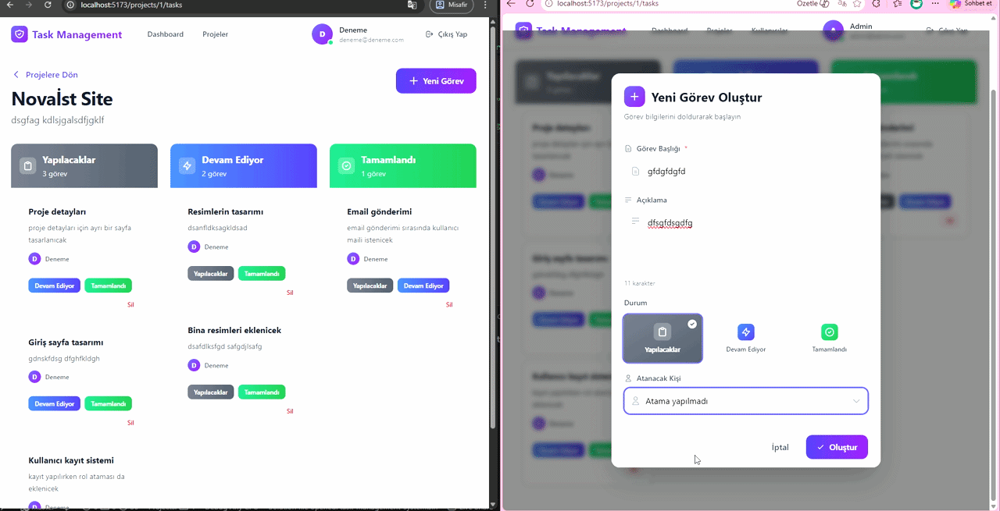

# 🚀 Task Management System

ASP.NET Core Web API ve React kullanılarak geliştirilmiş full-stack bir görev ve proje yönetim uygulamasıdır.  
Bu sistem ekiplerin proje oluşturmasını, görev atamasını, süreçleri takip etmesini ve rol bazlı yetkilendirme ile kullanıcı yönetimini sağlar.

---

## 🧠 Özellikler

- 🔐 JWT Authentication & Authorization
- 👥 Rol Yönetimi (Admin, Project Manager, Developer)
- 📁 Proje Yönetimi
- ✅ Görev Yönetimi (Kanban Board)
- 📊 İstatistiksel Dashboard
- 👤 Kullanıcı Yönetimi
- 🔔 SignalR ile gerçek zamanlı bildirim sistemi
- 🎨 Modern ve responsive arayüz

---

## 🔔 Gerçek Zamanlı Bildirim Sistemi (SignalR)

Bir kullanıcıya görev atandığında, ilgili kullanıcıya **sayfa yenilenmeden anlık bildirim** gönderilir.  
Bu yapı SignalR kullanılarak geliştirilmiştir ve sistem içi ekip iletişimini hızlandırmayı amaçlar.

### 🎬 SignalR Bildirim Demo



---

## 🏗️ Mimari

Bu proje **N-Tier Architecture** yapısı ile geliştirilmiştir:

- Core
- Entity
- DataAccess
- Business
- API

---

## 🛠️ Kullanılan Teknolojiler

### 🔙 Backend
- ASP.NET Core Web API
- Entity Framework Core
- MSSQL
- JWT Authentication
- SignalR

### 🎨 Frontend
- React (Vite)
- Axios

---

## 📸 Ekran Görüntüleri

### 🔹 Dashboard


### 🔹 Projeler


### 🔹 Görev Board


### 🔹 Görev Oluşturma


### 🔹 Kullanıcı & Rol Yönetimi


---

## ⚙️ Kurulum

### 🔙 Backend

```bash
dotnet restore
dotnet ef database update
dotnet run
```
### Frontend

```bash
cd client
npm install
npm run dev
```

### Demo User
Email: admin@admin.com
Password: 123456

